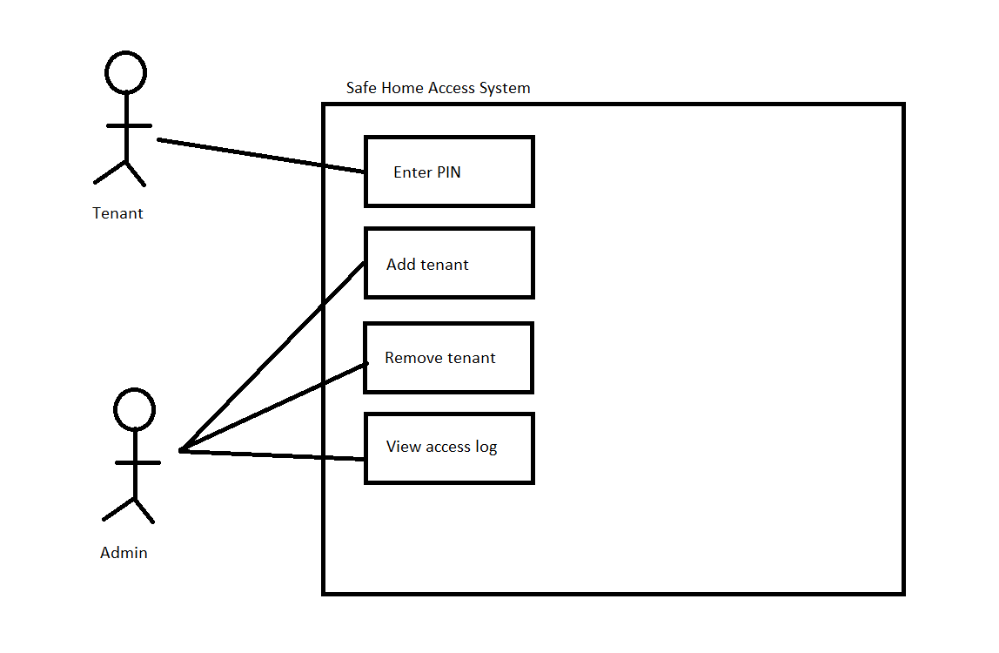

# Lab 7 - Safe Home Access

## Exercise 1 - Java implementation

Implement a safe home access Java application based on the diagram above. Consider the following functional requirements in implementing your program:
1. If the pin is wrong _enterPin_ method shall throw an _InvalidPinException_.
2. If 3 consecutive fail attempts are made to enter the pin then door is locked(until master key pin is used) and _enterPin_ method shall throw TooManyAttemptsException. Any further invocations of the _enterPin_ method will throw TooManyAttemptsException.
3. If the master key pin is used, the door will be unlocked and retries count will be reset to 0. 
4. If the pin is correct, the door shall be opened or closed depending on the current state (if open it will be closed, if closed it will be opened)
5. When the tenant already exists (verify the name), _addTenant_ method will throw TenantAlreadyExistsException.
6. When the tenant is not found, _removeTenant_ method will throw TenantNotFoundException. 
7. All attempts (successful or not) will be logged in access log list.
8. A console based user interface should be implemented for the above system. The first promt should allow the selection of the user type, Admin or Tenant.
The Tenant should only be able to enter the pin in order to open/close the door.
The Admin should be able to add and to remove tenants, and to view the acess logs. 

**NOTE - The Java project comes with predefined unit tests. You should make sure all tests pass. You are not allowed to change unit tests (except for the initialisation of Controller object in the _instantiateDoorController()_ method**).

## Exercise 2 - Use case diagram

Create the _UML use case_ diagram for the Safe Home Access application.

## Exercise 3 - Sequence diagram(s)

Text sequence diagram(s) for the Safe Home Access application.

Entities:

Tenant
System Administrator
DoorLockController
Door
AccessLog
Sequence diagram for Tenant entering PIN:

1. Tenant -> DoorLockController: enterPin(pin)
2. DoorLockController -> Door: getStatus()
3. DoorLockController -> Door: changeStatus()
4. Door -> Door: updateStatus()
5. DoorLockController -> AccessLog: addLogEntry(entry)
6. DoorLockController <- Door: return doorStatus
7. Tenant <- DoorLockController: return doorStatus

Sequence diagram for System Administrator adding a tenant:

1. System Administrator -> DoorLockController: addTenant(pin, name)
2. DoorLockController -> AccessLog: addLogEntry(entry)
3. System Administrator <- DoorLockController: return success/error

Sequence diagram for System Administrator removing a tenant:

1. System Administrator -> DoorLockController: removeTenant(name)
2. DoorLockController -> AccessLog: addLogEntry(entry)
3. System Administrator <- DoorLockController: return success/error

Sequence diagram for System Administrator viewing access log:

1. System Administrator -> DoorLockController: getAccessLog()
2. DoorLockController -> AccessLog: getLogEntries()
3. System Administrator <- DoorLockController: return accessLog

Create the _UML sequence_ diagram for the Safe Home Access application.
The entities that should appear in the diagram(s) are:
1. The two user types, each with its own operations.
2. The Door Lock Controller.
3. The Door.
4. The Access Log.

