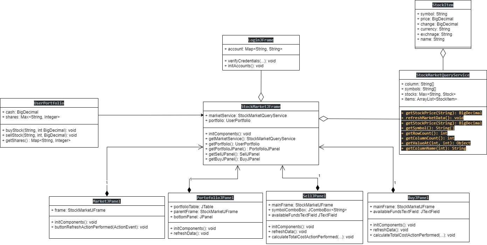

# Lab 9

**Stocks Portfolio Management Application**

Note: The project uses Lombok. 
Please install the Lombok plugin. **In IntelliJ: File->Settings...->Plugins - search 'Lombok'**

## Exercise 1 

Implement a basic stock portfolio tracker application starting from the example provided in package exercise 1.

The aplication should provide following functionalities:
- Authentication (Login) - finish the login implementation. Currently, the credentials are not verified; anyone can access the application.

- View market stocks and their current value - this feature is implemented and can be used as reference for next exercises;

- View user portofolio owned stocks
    - View owned stocks in a table view similar to Market;
    - For each owned stock display in table followings: symbol, quantity, price per unit, total price of the position;
    - Also add available funds (cash).

- Buy stock:
    - Implement "Buy" button functionality;
    - Buy is limited by available cache funds (stored in Portfolio class, attribute "cash");

- Sell stock
    - Create user interface similar to Buy interface
    - Symbol dropdown button should display only stocks owned by user;
    - When the sell is completed, the available funds should increase with the value of the transaction;

 

### Implementation notes

Note 1 - Stock symbols are hardcoded in StockMarketQueryService      private String[] symbols = new String[] {"INTC", "BABA", "TSLA", "AIR.PA", "MSFT", "AAPL", etc.}; You can add your own symbol as long as correspond to some real market symbols.

Note 2 - For getting financial market information the application use https://financequotes-api.com/ library:

        <dependency>
            <groupId>com.yahoofinance-api</groupId>
            <artifactId>YahooFinanceAPI</artifactId>
            <version>3.15.0</version>
        </dependency>

## Exercise 2

## Exercise 3 (Optional)

The app can be implemented in Java using the Model-View-Controller (MVC) design pattern. Here's a brief overview of how each component of the app can be implemented using the MVC pattern:

- Model: The Model represents the data and business logic of the app. In this case, the data includes stock market data and user portfolio data. The Model can be implemented using classes such as StockMarketQueryService and UserPortfolio.

- View: The View represents the user interface of the app. In this case, the View can be implemented using classes such as LoginJFrame, StockMarketJFrame, MarketJPanel, PortofolioJPanel, BuyJPanel, and SellJPanel.

- Controller: The Controller acts as an intermediary between the Model and the View. It handles user input and updates the Model and View accordingly. In this case, the Controller can be implemented using event listeners in the View classes, such as the button listener in LoginJFrame and the refresh button listener in MarketJPanel.

To implement the app using the MVC pattern, the following steps can be taken:

Define the Model classes and methods that will retrieve and manipulate the stock market and user portfolio data.

Define the View classes that will display the user interface and handle user input.

Implement the Controller logic in the event listeners of the View classes. The Controller should interact with the Model to retrieve and update data, and update the View to display the changes.

Use a framework such as Java Swing to create the user interface components and bind them to the Model and Controller logic.

By following the MVC pattern, the app can be designed in a way that separates concerns between the data, user interface, and logic, making it easier to maintain and modify in the future.

## Exercise 4 (Optional)

Add a layer of persistence to your application:
- Save the accounts in a file on the disk.
- Save the user's portfolios on the disk. Keep in mind that you can have multiple users.
- You can use either Java's native serialization support or the JSON format.